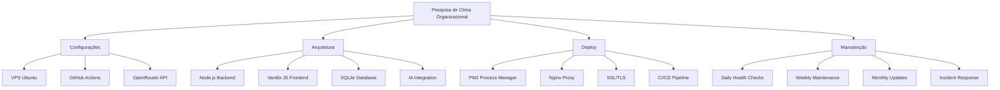

# Documentação Obsidian - Pesquisa de Clima Organizacional

## Bem-vindo ao Documentação Obsidian!

Este é o espaço central de documentação para o projeto de Pesquisa de Clima Organizacional da Nordeste Locações. Aqui você encontrará toda a informação necessária para entender, desenvolver, deploy e manter o sistema.

## Estrutura da Documentação

### **Configurações e Setup**
- [[00-Configuração-VPS]] - Configuração completa do servidor VPS
- [[01-Configuração-GitHub]] - Configuração do repositório e fluxo de trabalho
- [[02-Chaves-e-APIs-IA]] - Configuração das APIs de IA e chaves de acesso

### **Arquitetura e Desenvolvimento**
- [[03-Arquitetura-e-Estrutura]] - Arquitetura do sistema e estrutura de pastas
- [[06-Templates-e-Checklists]] - Templates para desenvolvimento e processos

### **Deploy e Operações**
- [[04-Guia-de-Deploy]] - Guia completo de deploy em produção
- [[05-Manutenção-e-Troubleshooting]] - Manutenção programada e solução de problemas

### **Documentação Principal**
- [[OBSIDIAN_DOCUMENTATION]] - Documentação completa e referência rápida

## Mapa Mental do Projeto



## Como Usar Esta Documentação

### Para Desenvolvedores
1. Leia [[03-Arquitetura-e-Estrutura]] para entender o sistema
2. Use [[06-Templates-e-Checklists]] para seguir padrões
3. Consulte [[02-Chaves-e-APIs-IA]] para configurações de IA

### Para DevOps/Infraestrutura
1. Siga [[00-Configuração-VPS]] para setup do servidor
2. Use [[04-Guia-de-Deploy]] para deploy em produção
3. Implemente [[05-Manutenção-e-Troubleshooting]] para operações

### Para Gestores
1. Revise [[OBSIDIAN_DOCUMENTATION]] para visão geral
2. Monitore checklists de manutenção
3. Acompanhe incidentes e recovery

## Links Rápidos

### **Essenciais**
- [Repositório GitHub](https://github.com/SEU_USER/pesquisa-declima-nitai)
- [Aplicação em Produção](https://SEU_DOMINIO.com.br)
- [Dashboard de Monitoramento](https://monitor.SEU_DOMINIO.com.br)
- [Status Page](https://status.SEU_DOMINIO.com.br)

### **Documentação Externa**
- [OpenRouter API Docs](https://openrouter.ai/docs)
- [PM2 Documentation](https://pm2.keymetrics.io/docs/)
- [Node.js Docs](https://nodejs.org/docs/)
- [SQLite Documentation](https://sqlite.org/docs.html)

### **Ferramentas**
- [Obsidian](https://obsidian.md/) - Ferramenta de documentação
- [GitHub](https://github.com/) - Controle de versão
- [VS Code](https://code.visualstudio.com/) - IDE
- [Postman](https://www.postman.com/) - Testes de API

## Tags Principais

Use estas tags para organizar e encontrar informações:

- `#config` - Configurações e setup
- `#deploy` - Processos de deploy
- `#api` - APIs e integrações
- `#security` - Segurança
- `#monitoring` - Monitoramento e logs
- `#troubleshooting` - Solução de problemas
- `#maintenance` - Manutenção programada
- `#development` - Desenvolvimento

## Fluxos de Trabalho

### **Novo Desenvolvimento**
1. Planejar em [[06-Templates-e-Checklists]]
2. Desenvolver seguindo [[03-Arquitetura-e-Estrutura]]
3. Testar com templates de testes
4. Deploy usando [[04-Guia-de-Deploy]]

### **Resolução de Incidentes**
1. Identificar problema
2. Consultar [[05-Manutenção-e-Troubleshooting]]
3. Usar checklist de incident response
4. Documentar aprendizados

### **Manutenção Rotineira**
1. Seguir checklist semanal
2. Monitorar métricas
3. Atualizar documentação
4. Planejar melhorias

## Comandos Rápidos

### **Desenvolvimento**
```bash
# Iniciar ambiente de desenvolvimento
npm run dev

# Rodar testes
npm test

# Linting
npm run lint

# Build
npm run build
```

### **Deploy**
```bash
# Deploy automático
./scripts/deploy.sh

# Health check
./scripts/health-check.sh

# Backup
./scripts/backup.sh
```

### **Monitoramento**
```bash
# Status PM2
pm2 status

# Logs
pm2 logs pesquisa-clima

# Monitoramento
pm2 monit
```

## Contatos e Suporte

### **Equipe Técnica**
- **Desenvolvedor Principal**: [Nome] - [Email/Telefone]
- **DevOps**: [Nome] - [Email/Telefone]
- **QA**: [Nome] - [Email/Telefone]

### **Suporte Externo**
- **Hospedagem**: [Contato da provedora]
- **OpenRouter**: [Suporte da API]
- **GitHub**: [Suporte do repositório]

### **Canais de Comunicação**
- **Slack**: #pesquisa-clima
- **Email**: dev@nordeste-locacoes.com.br
- **Emergência**: [Telefone 24/7]

## Métricas e KPIs

### **Desenvolvimento**
- **Velocity**: {story points/sprint}
- **Bug Rate**: {bugs/mês}
- **Code Coverage**: {porcentagem}
- **Deploy Frequency**: {deploys/semana}

### **Operações**
- **Uptime**: {porcentagem}
- **Response Time**: {milissegundos}
- **Error Rate**: {porcentagem}
- **User Satisfaction**: {score}

### **Negócios**
- **Adoption Rate**: {porcentagem}
- **Completion Rate**: {porcentagem}
- **User Engagement**: {métrica}
- **ROI**: {valor}

## Roadmap

### **Q2 2026**
- [ ] Implementar analytics avançado
- [ ] Adicionar gamificação
- [ ] Melhorar performance do chat
- [ ] Expandir integrações

### **Q3 2026**
- [ ] Mobile app
- [ ] Machine learning predictions
- [ ] Advanced reporting
- [ ] Multi-tenant support

### **Q4 2026**
- [ ] Enterprise features
- [ ] Advanced security
- [ ] API pública
- [ ] Internationalization

## Melhores Práticas

### **Documentação**
- Mantenha documentação atualizada
- Use exemplos práticos
- Inclua comandos e screenshots
- Revise regularmente

### **Desenvolvimento**
- Siga padrões estabelecidos
- Escreva testes automatizados
- Documente código complexo
- Use versionamento semântico

### **Operações**
- Monitore continuamente
- Automatize quando possível
- Tenha planos de recovery
- Documente incidentes

## FAQ

### **Perguntas Frequentes**

**Q: Como resetar a senha de admin?**
A: Consulte [[05-Manutenção-e-Troubleshooting#reset-senha]]

**Q: Como configurar nova chave de API?**
A: Siga [[02-Chaves-e-APIs-IA#configuracao]]

**Q: Como fazer rollback de deploy?**
A: Use [[04-Guia-de-Deploy#rollback]]

**Q: Como monitorar performance?**
A: Consulte [[05-Manutenção-e-Troubleshooting#monitoramento]]

## Glossário

- **VPS**: Virtual Private Server
- **PM2**: Process Manager for Node.js
- **CI/CD**: Continuous Integration/Continuous Deployment
- **IA**: Inteligência Artificial
- **API**: Application Programming Interface
- **SSL/TLS**: Secure Sockets Layer/Transport Layer Security

## Histórico de Mudanças

### **v2.0.0** (20/04/2026)
- Adicionada documentação completa no Obsidian
- Implementados templates e checklists
- Criados guias de deploy e manutenção
- Documentada arquitetura completa

### **v1.0.0** (01/03/2026)
- Sistema inicial implementado
- Funcionalidades básicas
- Documentação mínima

---

## Pesquisa Rápida

Use `Ctrl+F` para buscar termos específicos ou navegue pelos links acima.

### **Tópicos Populares**
- #config - Configurações iniciais
- #deploy - Como fazer deploy
- #troubleshooting - Solução de problemas
- #api - Integrações de IA
- #monitoring - Saúde do sistema

---

*Última atualização: 20/04/2026*
*Responsável: [Seu Nome]*
*Versão: 2.0.0*
